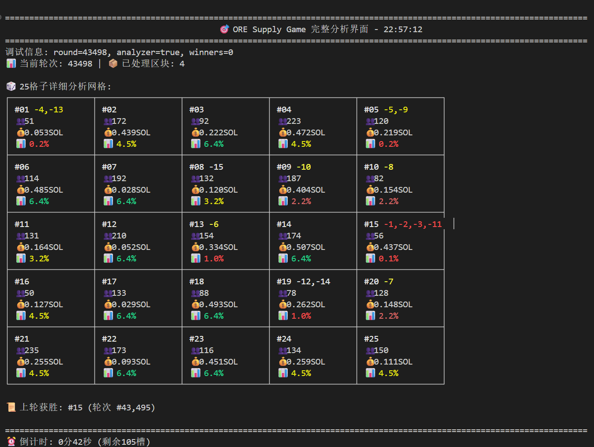

# ORE Supply 游戏胜率分析器

📞 **联系作者：**
- Telegram: [https://t.me/Block_devp](https://t.me/Block_devp)
- X (Twitter): [https://x.com/OSDCoin](https://x.com/OSDCoin)

---

## 项目概述

ORE Supply 游戏胜率分析器是一个复杂的分析工具，专门用于分析基于 Solana 区块链的 ORE Supply 游戏。该分析器提供数据驱动的洞察和概率计算，帮助玩家做出明智的投注决策。本分析器使用先进的算法，包括贝叶斯推理、时间衰减模型和历史模式分析，来预测 25 个游戏格子中每个格子的获胜概率。



## 功能特性

### 🎯 核心分析功能
- **实时游戏监控**：持续监控 Solana 主网上的 ORE Supply 游戏状态
- **概率分析**：使用历史数据计算所有 25 个格子的获胜概率
- **智能推荐选择**：基于贝叶斯分析提供前 3 个推荐格子
- **高级模式识别**：识别获胜序列中的趋势和模式

### 📊 分析方法
1. **贝叶斯时间衰减模型**：使用狄利克雷-多项式后验分布与指数时间衰减
2. **反连胜分析**：对最近获胜的格子应用惩罚以多样化推荐
3. **资金池效率计算器**：分析风险收益比以制定最优投注策略
4. **历史模式分析**：利用 15-25 轮的历史数据进行预测

### 🔍 关键指标
- **轮次信息**：当前轮次号和格子详情
- **参与者数据**：每个格子的参与人数和 SOL 投入金额
- **获胜概率**：计算出的 25 个格子的获胜概率
- **风险评估**：多级风险分析（低/中/高）
- **效率评级**：每个格子的投资效率评分

## 安装说明

### 系统要求
- Node.js (v14 或更高版本)
- npm 或 yarn 包管理器

### 安装步骤
1. 克隆仓库：
```bash
git clone <repository-url>
cd ore-winrate
```

2. 安装依赖：
```bash
npm install
```

3. 配置 RPC 端点（可选）：
```bash
# 设置自定义 RPC URL 作为环境变量
export RPC_URL="your-solana-rpc-endpoint"
```

## 使用方法

### 基本命令

#### 启动实时分析
```bash
npm start
# 或者
node api-scraper.js
```

#### 运行概率分析
```bash
npm run analyze
# 或者
node probability-analyzer.js
```

#### 读取当前轮次数据
```bash
npm run read-round
# 或者
node read-round.js
```

### 高级用法

#### 生成智能推荐
```bash
node smart-picks.js
```

#### 运行高级分析
```bash
node advanced-analyzer.js
```

#### 清理和优化数据
```bash
node cleanup-v2.js
```

## 理解输出结果

### 分析界面元素


分析界面显示以下内容：

1. **头部信息**：
   - 当前轮次号（例如：round=43498）
   - 分析状态和获胜者数量
   - 时间戳和处理统计信息

2. **格子网格（5x5）**：
   - 格子编号（#01-#25）
   - 参与者数量（例如：51, 172, 92）
   - 投入的 SOL 金额（例如：0.053SOL, 0.439SOL）
   - 获胜概率百分比（颜色编码）

3. **概率颜色编码**：
   - 🟢 **高概率**（6.4%+）：最佳投注机会
   - 🟡 **中等概率**（4.0-6.3%）：适中的机会
   - 🟠 **低概率**（2.0-3.9%）：较高风险投注
   - 🔴 **极低概率**（<2.0%）：避免这些格子

4. **推荐选择**：
   - 显示推荐的前几个格子及其理由
   - 显示具体概率和风险评估

## 文件结构

```
ore-winrate/
├── api-scraper.js          # 主分析器和实时监控
├── probability-analyzer.js  # 核心概率计算引擎
├── advanced-analyzer.js    # 高级模式分析
├── smart-picks.js          # 贝叶斯推荐系统
├── read-round.js           # 轮次数据读取器
├── cleanup-v2.js           # 数据清理工具
├── ev-picks.js             # 期望值计算
├── winners.json            # 历史获胜者数据
├── package.json            # 项目配置
└── ore/                    # Solana 程序集成
    ├── api/                # API 接口
    ├── cli/                # 命令行工具
    └── program/            # Solana 程序代码
```

## 算法详情

### 1. 贝叶斯时间衰减模型
- 使用均匀狄利克雷先验（每个格子 α = 1.0）
- 应用指数时间衰减，10 轮半衰期
- 分析最近 30 轮的历史数据
- 后验概率：`p_k = (α + w_k) / (N*α + Σw)`

### 2. 反连胜惩罚系统
- 最近获胜者：×0.6 概率乘数
- 上一轮获胜者：×0.8 概率乘数
- 鼓励投注策略的多样化

### 3. 资金池效率分析
- 计算投资效率比率
- 考虑参与者数量和 SOL 投入金额
- 提供风险调整后的推荐

### 4. 模式识别
- 识别热门和冷门连胜
- 分析获胜的时间模式
- 根据最近趋势调整概率

## 配置设置

### 环境变量
- `RPC_URL`：自定义 Solana RPC 端点（默认：Helius 主网）
- `PROGRAM_ID`：Solana 上的 ORE 程序 ID

### 分析参数
- `BLOCKS_TO_ANALYZE`：分析中的格子数量（默认：25）
- `HISTORICAL_ROUNDS`：考虑的历史数据轮次（默认：30）
- `TIME_DECAY_HALF_LIFE`：时间衰减的半衰期（默认：10 轮）

## API 集成

分析器与 Solana 区块链集成以获取实时数据：

- **程序 ID**：`oreV3EG1i9BEgiAJ8b177Z2S2rMarzak4NMv1kULvWv`
- **网络**：Solana 主网
- **数据源**：链上程序账户和历史交易

## 贡献指南

1. Fork 仓库
2. 创建功能分支：`git checkout -b feature-name`
3. 提交更改：`git commit -am 'Add new feature'`
4. 推送到分支：`git push origin feature-name`
5. 提交拉取请求

## 许可证

本项目基于 MIT 许可证 - 详见 LICENSE 文件。

## 免责声明

此工具仅用于教育和分析目的。赌博涉及风险，过去的表现不能保证未来的结果。请始终负责任地赌博，永远不要下注超过您能承受损失的金额。

## 技术支持

如需技术支持或有疑问：
- Telegram: [https://t.me/Block_devp](https://t.me/Block_devp)
- X: [https://x.com/OSDCoin](https://x.com/OSDCoin)

---

**祝您分析愉快！🎯📊**